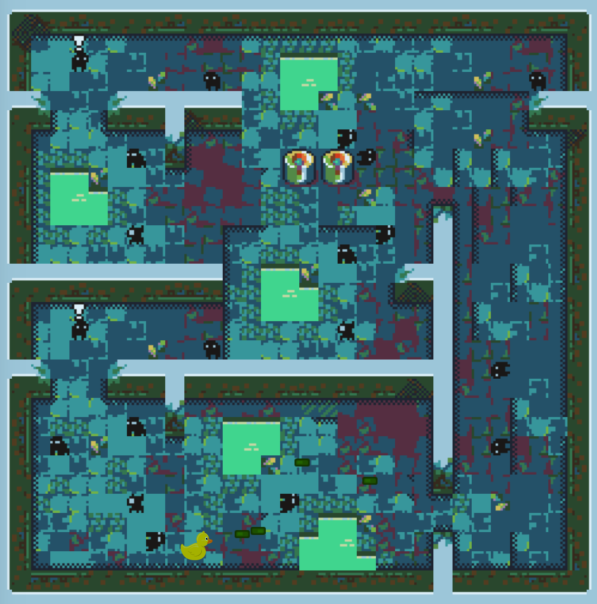

# oskhen-ahanifi-game
Another week(s) of python 
### Current state of the game


## How to run
First clone the repo. Navigate to where the repo was cloned to and run the following command to install the necessary dependencies
``` 
pip install -r requirements.txt
```
Then to run the game type
```
python bouncing_bullet.py
```

To change from PvP mode to either PvE or EvE edit the mode setting in ```config.cfg``` to PvE or EvE respectively

## Key bindings

### Player 1            

|  Key | Action   |     
|---|---|
|  W | Move Up  |
|  A | Move Left  |
|  S | Move Down  |
|  D | Move Right  |
|  LShift | Dash  |
|  Space | Shoot  |

### Player 2           

|  Key | Action   |     
|---|---|
|  I | Move Up  |
|  J | Move Left  |
|  K | Move Down  |
|  DL | Move Right  |
|  Minus | Dash  |
|  Period | Shoot  |

These key bindings can be changed by editing the ```config.cfg``` file

## AI support

To create an AI for this game include the path of the python script in the config file ```config.cfg```. The script should take in an observation of the current state and the action space of the agent and return what actions to take. 

```py
    def func(observations,action_space):
        ...
        return actions
```
- The observation is a spatiall representation of every tile of the game world in a 52 x 32 matrix. [0,0] element is the bottom left tile and [51,31] is the top right tile.
- The action space is a vector of the dimensions of the discrete action spaces. The discrete action spaces represent movement in x direction, movement in y direction, shooting and dashing. As such the action space is ```[3,3,2,2]```. 
- The actions returned should be a list of 2-dimensional integer tuples where the first element is which discrete action space, starting from 0, and the second element which action in that discrete action space. Check the action table further down for reference.

|  Tuple |  Action |
|---  |---|
|(0,0)| Don't move in x |
|(0,1)| Go Left         |
|(0,2)| Go Right        |
|(1,0)| Don't move in y |
|(1,1)| Go Up           |
|(1,2)| Go Down         |
|(2,0)| Don't Shoot     |
|(2,1)| Shoot           |
|(3,0)| Don't Dash      |
|(3,1)| Dash            |


